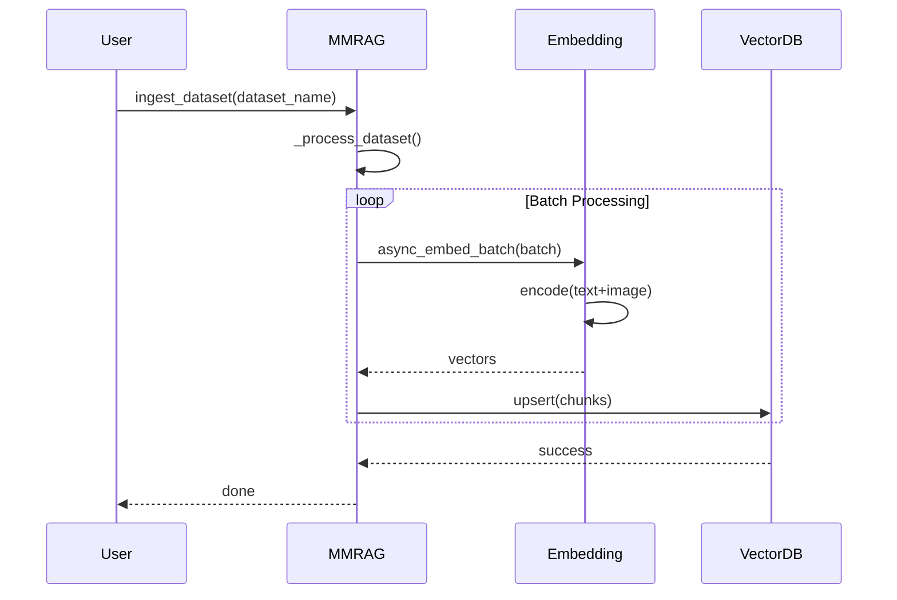
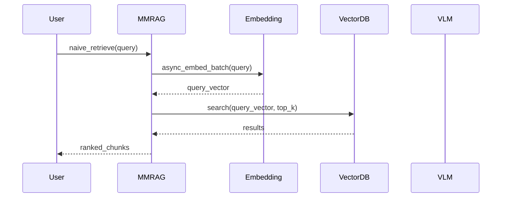
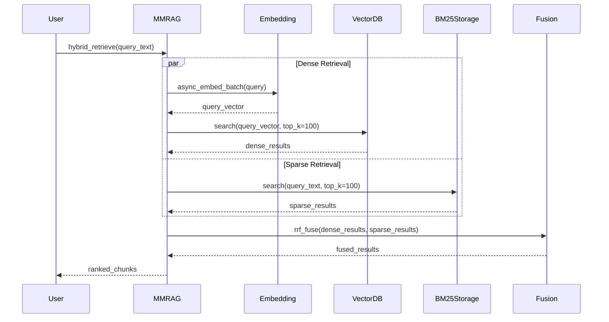

# 架构设计文档

## 系统架构概览

Medical-Agentic-RAG 采用分层架构设计，包含以下核心层次：

```
┌─────────────────────────────────────────────────────────────┐
│                    Application Layer                        │
│  ┌──────────────┐ ┌──────────────┐ ┌──────────────────────┐ │
│  │    Web UI    │ │   API Server │ │   Evaluation Tools   │ │
│  └──────────────┘ └──────────────┘ └──────────────────────┘ │
├─────────────────────────────────────────────────────────────┤
│                    Agentic RAG Layer                        │
│  ┌─────────────────────────────────────────────────────┐   │
│  │                    RL Agent                         │   │
│  │  ┌──────────────┐ ┌──────────────┐ ┌─────────────┐ │   │
│  │  │   Planner    │ │ Tool Executor│ │   Memory    │ │   │
│  │  └──────────────┘ └──────────────┘ └─────────────┘ │   │
│  └─────────────────────────────────────────────────────┘   │
├─────────────────────────────────────────────────────────────┤
│                    Core RAG Layer                           │
│  ┌──────────────────┐  ┌──────────────────────────────┐    │
│  │   MMRAG Engine   │  │      Retrieval Pipeline      │    │
│  │  - Data Ingest   │  │  - Query Understanding       │    │
│  │  - Vector Store  │  │  - Multi-modal Retrieval     │    │
│  │  - Reranking     │  │  - Result Fusion             │    │
│  └──────────────────┘  └──────────────────────────────┘    │
├─────────────────────────────────────────────────────────────┤
│                    Model Service Layer                      │
│  ┌──────────────┐ ┌──────────────┐ ┌──────────────────┐    │
│  │  Embedding   │ │    VLM       │ │   Reranker       │    │
│  │   Service    │ │  Service     │ │   Service        │    │
│  └──────────────┘ └──────────────┘ └──────────────────┘    │
├─────────────────────────────────────────────────────────────┤
│                    Data Layer                               │
│  ┌──────────────┐ ┌──────────────┐ ┌──────────────────┐    │
│  │   Milvus     │ │    Faiss     │ │   Dataset Cache  │    │
│  │   (Vector)   │ │   (Vector)   │ │   (Images/Text)  │    │
│  └──────────────┘ └──────────────┘ └──────────────────┘    │
└─────────────────────────────────────────────────────────────┘
```

## 核心组件详解

### 1. MMRAG Engine (MMRAG/MMRAG.py)

多模态RAG的核心引擎，负责文档的入库、检索和生成。

**核心功能**:

| 方法 | 功能 | 异步支持 |
|------|------|---------|
| `ingest_dataset()` | 数据集入库 | ✅ |
| `retrieve()` | 向量检索 | ✅ |
| `aquery()` | 完整RAG查询 | ✅ (待实现) |
| `delete_document()` | 文档删除 | ✅ |

**数据流**:
```
Raw Dataset → DataChunk → Embedding → Vector Store
```

### 2. Storage Layer

#### 2.1 MilvusVectorStorage (MMRAG/DB/milvus_vectorDB.py)

基于 Milvus Lite 的本地向量存储实现，提供稠密向量检索能力。

**特点**:
- 本地文件存储 (`.db`)
- 支持动态字段
- 自动持久化
- 支持 IP (内积) 和 L2 距离度量

**Schema设计**:
```python
{
    "chunk_id": VARCHAR (primary key),
    "vector": FLOAT_VECTOR (dim=2048),
    "doc_id": VARCHAR,
    "content": TEXT,
    "image_paths": JSON,
    "file_path": VARCHAR,
    "metadata": JSON (dynamic)
}
```

#### 2.2 BM25Storage (MMRAG/DB/bm25_storage.py)

基于 BM25 算法的稀疏检索存储实现，提供关键词检索能力。

**特点**:
- 支持中英文混合分词（jieba + regex）
- 停用词过滤
- 增量更新和删除
- 持久化到本地文件

**文件组织**:
```
workspace/bm25/
├── bm25_index.pkl    # 序列化的BM25索引
├── corpus.pkl        # 分词后的文档集合
└── metadata.json     # chunk_id映射和原始文本
```

**BM25参数**:
- `k1`: 1.5 (词频饱和参数)
- `b`: 0.75 (长度归一化参数)

### 3. 混合检索 (Hybrid Retrieval)

#### 3.1 架构设计

```
                    Query
                      │
        ┌─────────────┴─────────────┐
        ▼                           ▼
   [Embedding]                 [Tokenization]
        │                           │
        ▼                           ▼
   Dense Retrieval            Sparse Retrieval
   (MilvusVector)             (BM25Storage)
   - 语义相似度                - 关键词匹配
        │                           │
        └─────────────┬─────────────┘
                      ▼
                [RRF Fusion]
                      │
                      ▼
                TopK Results
```

#### 3.2 RRF融合算法 (MMRAG/retrieval_fusion.py)

**Reciprocal Rank Fusion (RRF)** 公式:
```
RRF_score(d) = Σ(1 / (k + rank_i(d)))
```

其中:
- `k`: 常数（默认60），用于平滑排名差异
- `rank_i(d)`: 文档d在第i个检索结果中的排名

**特点**:
- 不需要对不同检索方法的分数进行归一化
- 在多个列表中出现的文档获得更高分数
- 对排名位置敏感，而非原始分数

**接口**:
```python
def rrf_fuse(
    dense_results: List[Tuple[str, float]],   # 向量检索结果
    sparse_results: List[Tuple[str, float]],  # BM25检索结果
    k: float = 60.0,
    top_k: int = 10
) -> List[Tuple[str, float]]:
    """返回融合后的(chunk_id, rrf_score)列表"""
```

#### 3.3 MMRAG混合检索接口

```python
async def hybrid_retrieve(
    self,
    query_text: str,
    query_image_paths: Optional[list[str]] = None,
    top_k: int = 10,
    fusion_k: float = 60.0,
    initial_top_k: int = 100
) -> list[DataChunk]:
    """
    混合检索流程:
    1. 生成query的embedding
    2. Dense检索：vector_storage.search (top 100)
    3. Sparse检索：bm25_storage.search (top 100)
    4. RRF融合结果 (top 10)
    5. 返回完整文档内容
    """
```

### 3. Embedding Service

#### VllmEmbeddingService

基于 vLLM 的本地 Embedding 服务部署。

**配置参数**:
- `tensor_parallel_size`: 2 (张量并行)
- `max_model_len`: 4096
- `gpu_memory_utilization`: 0.8

#### OpenaiEmbeddingService

兼容 OpenAI API 的 Embedding 服务。

**接口**:
```python
POST /v1/embeddings
{
    "messages": [...],
    "model": "Qwen3-VL-Embedding-2B",
    "encoding_format": "float"
}
```

### 4. Agentic RAG 架构

#### RL Agent

使用 GRPO (Group Relative Policy Optimization) 算法训练的智能代理。

**组件**:

| 组件 | 职责 |
|------|------|
| Planner | 规划检索策略，决定调用哪些工具 |
| Tool Executor | 执行检索工具，获取证据 |
| Memory | 维护对话历史和中间结果 |

#### 工具系统

**检索工具**:
1. `TextRetrievalTool` - 文本检索
2. `ImageRetrievalTool` - 图像检索

**工具调用格式**:
```python
{
    "tool": "text_retrieval",
    "arguments": {
        "query": "胸部X光片发现",
        "top_k": 5
    }
}
```

### 5. 数据流设计

#### 文档入库流程



#### 查询流程

**稠密检索 (Dense Retrieval)**:


**混合检索 (Hybrid Retrieval)**:


## 模块依赖关系

```
MMRAG/
├── base.py                 # 无依赖 (基础数据类)
├── utils.py                # 标准库
├── MMRAG.py                # 依赖: base, utils, DB, model_service, retrieval_fusion
├── retrieval_fusion.py     # 无依赖 (RRF融合算法)
├── DB/
│   ├── base.py             # 依赖: base
│   ├── milvus_vectorDB.py  # 依赖: base, utils (稠密向量存储)
│   └── bm25_storage.py     # 依赖: base, utils, rank_bm25, jieba (稀疏检索)
├── model_service/
│   ├── embedding_service.py
│   ├── vlm_service.py
│   └── rerank_service.py
├── agent/                  # (待实现)
│   ├── rl_agent.py
│   ├── tools.py
│   └── reward.py
└── task/
    ├── common.py
    └── *.py                # 数据集处理
```

## 扩展性设计

### 1. 新增向量数据库

继承 `BaseVectorStorage` 接口:
```python
class NewVectorStorage(BaseVectorStorage):
    async def upsert(self, chunks: list[DataChunk]) -> None: ...
    async def search(self, query_vector: list[float], top_k: int) -> list[DataChunk]: ...
    async def delete_by_doc_id(self, doc_id: str) -> None: ...
```

### 2. 新增Embedding服务

继承 `EmbeddingService` 接口:
```python
class NewEmbeddingService(EmbeddingService):
    async def async_embed_batch(self, inputs, batch_size) -> list[list[float]]: ...
```

### 3. 新增数据集处理

在 `MMRAG/task/` 下创建新的数据集类:
```python
class NewDataset(Dataset):
    def process_dataset(self, ...): ...
    def evaluate(self, index, conversation): ...
```
